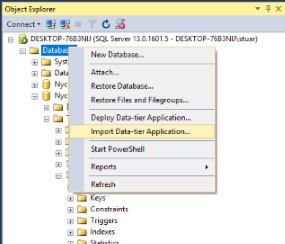

## SQL Server Data-tier

### NycLandmarks.dacpac    
Landmarks Database Schema

### NycLandmarks.bacpac     
Landmarks Database Schema & Data  

#### Importing Database (bacpac)

Click on SQL Server Database Folder in Mangement Studio
Select Import Data-Tier Application          
Except Defaults       

